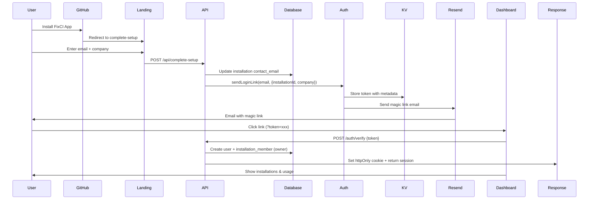
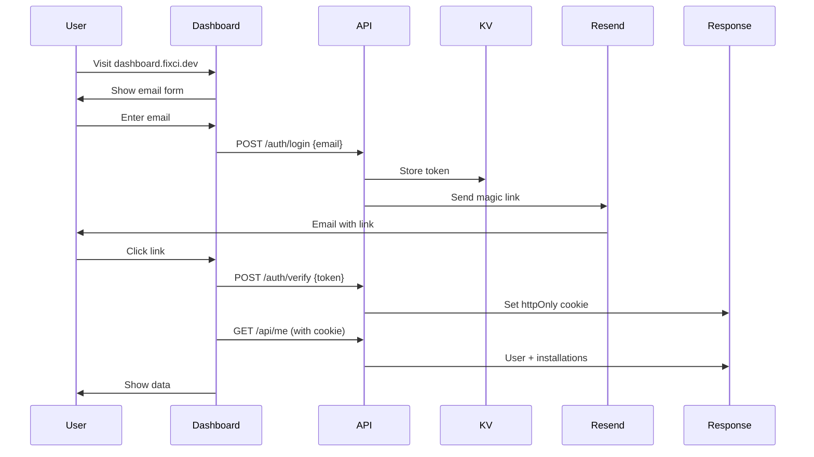

# User Management System - Implementation Summary

**Date:** December 30, 2025
**Status:** ✅ Complete and Deployed

## Overview

The FixCI user management system now supports:
- ✅ **Multiple users per installation** (team collaboration)
- ✅ **Multiple installations per user** (personal + organization accounts)
- ✅ **Role-based access control** (owner, admin, member)
- ✅ **Magic link authentication** (passwordless, secure)
- ✅ **Email verification** (verified emails only)
- ✅ **HttpOnly cookie sessions** (XSS protection)

---

## Architecture

### Database Schema

**Three new tables added in migration 002:**

```sql
-- Users: Email-based accounts
users (id, email, name, created_at, updated_at)

-- Installation Members: Many-to-many relationship
installation_members (id, user_id, installation_id, role, created_at)
  - Roles: 'owner', 'admin', 'member'

-- Auth Sessions: Magic link + session tokens
auth_sessions (id, user_id, token, expires_at, created_at)
```

**Current Data:**
- 5 users migrated from existing installations
- All existing installations linked to users as 'owner'

### Services

**1. Email Service** (`src/email.js`)
- Provider: Resend API
- Templates: Magic link, Welcome email
- Domain: `noreply@news.fixci.dev`
- Status: ✅ Configured (RESEND_API_KEY set)

**2. Auth Service** (`src/auth.js`)
- **sendLoginLink()** - Generate token, store in KV, send email
- **verifyToken()** - Verify email, create user, link installation, create session
- **verifySession()** - Check httpOnly cookie or Bearer token
- **logout()** - Delete session from D1 and KV

**3. Session Storage**
- **KV Namespace:** `SESSIONS` (2e8fae5e5a774cd0b5059234e7876df0)
- **Magic link tokens:** 10 minute TTL
- **Session tokens:** 30 day TTL
- **Dual storage:** KV (fast lookup) + D1 (audit trail)

---

## User Flows

### Flow 1: GitHub App Installation (New User)



### Flow 2: Dashboard Login (Existing User)



---

## API Endpoints

### Public Authentication

**POST /auth/login**
```json
Request: { "email": "user@company.com", "installationId": 123, "company": "Acme" }
Response: { "success": true, "message": "Check your email..." }
```

**POST /auth/verify**
```json
Request: { "token": "abc123..." }
Response: { "success": true, "user": {...} }
Sets Cookie: session=xxx; HttpOnly; Secure; SameSite=Strict; Max-Age=2592000
```

**POST /auth/logout**
```
Requires: Cookie: session=xxx
Response: { "success": true }
```

**GET /api/me**
```
Requires: Cookie: session=xxx
Response: {
  "user": { "id": 1, "email": "user@company.com", "name": null },
  "installations": [
    {
      "installation_id": 123,
      "account_login": "acme-corp",
      "role": "owner",
      "tier": "free",
      "status": "active",
      "analyses_used_current_period": 2,
      "analyses_limit_monthly": 10
    }
  ]
}
```

### Setup Flow

**POST /api/complete-setup**
```json
Request: { "installationId": 123, "email": "user@company.com", "company": "Acme" }
Response: { "success": true, "message": "Check your email for a login link..." }
```

### Admin API

**GET /admin/installations/:id/members**
```
Requires: Authorization: Bearer ADMIN_API_KEY
Response: {
  "installationId": 123,
  "members": [
    {
      "user_id": 1,
      "email": "user@company.com",
      "name": null,
      "role": "owner",
      "created_at": "2025-12-30T..."
    }
  ],
  "count": 1
}
```

---

## Deployed Services

| Service | URL | Status |
|---------|-----|--------|
| **Landing Page** | https://fixci.dev | ✅ Deployed (v977dfaea) |
| **GitHub App API** | https://fixci-github-app.adam-vegh.workers.dev | ✅ Deployed (vbdaceb2a) |
| **User Dashboard** | https://main.fixci-dashboard.pages.dev | ✅ Deployed |
| **Admin Dashboard** | Not yet mapped to custom domain | ⚠️ Needs DNS |

---

## Security Features

### ✅ Implemented

1. **Magic Link Authentication**
   - Tokens stored in KV with 10-minute TTL
   - One-time use (deleted after verification)
   - Token in POST body (not URL) for verification

2. **HttpOnly Cookies**
   - Session token in httpOnly cookie (JavaScript cannot access)
   - SameSite=Strict (CSRF protection)
   - Secure flag (HTTPS only)
   - 30-day expiration

3. **Email Verification**
   - User accounts only created after email verification
   - Installation link only created after verification
   - No user data before email proof

4. **Rate Limiting**
   - /auth/login endpoint is rate-limited (existing implementation)
   - Protects against brute force attacks

5. **Role-Based Access**
   - Three roles: owner (full control), admin (manage), member (view)
   - Installation_members junction table enforces permissions
   - Future: Check role before allowing actions

---

## Testing Checklist

### Manual Testing

**Test 1: New Installation**
- [ ] Install FixCI GitHub App on test repository
- [ ] Redirected to complete-setup page
- [ ] Enter email + company name
- [ ] See "Check Your Email!" success message
- [ ] Receive email with magic link
- [ ] Click link → redirected to dashboard with httpOnly cookie
- [ ] See installation listed with "owner" role
- [ ] Verify user created in D1
- [ ] Verify installation_member created with role='owner'

**Test 2: Existing User Login**
- [ ] Visit dashboard.fixci.dev
- [ ] Enter email address
- [ ] Receive magic link email
- [ ] Click link → authenticated
- [ ] See all installations you own/belong to
- [ ] Logout works (cookie cleared)
- [ ] Cannot access /api/me without cookie

**Test 3: Multiple Installations**
- [ ] Same user installs app on 2nd repository
- [ ] Complete setup with same email
- [ ] Dashboard now shows 2 installations
- [ ] Both have "owner" role
- [ ] Usage tracked separately

**Test 4: Admin Panel**
- [ ] Open admin dashboard
- [ ] Search for installation
- [ ] Click installation → see "Team Members" section
- [ ] Shows user email, role, joined date

### Database Verification

```bash
# Check users table
npx wrangler d1 execute fixci-db --remote \
  --command="SELECT * FROM users"

# Check installation_members
npx wrangler d1 execute fixci-db --remote \
  --command="SELECT im.*, u.email, i.account_login FROM installation_members im JOIN users u ON im.user_id = u.id JOIN installations i ON im.installation_id = i.installation_id"

# Check active sessions
npx wrangler d1 execute fixci-db --remote \
  --command="SELECT user_id, COUNT(*) as session_count FROM auth_sessions WHERE expires_at > datetime('now') GROUP BY user_id"
```

### API Testing

```bash
# Test login endpoint
curl -X POST https://fixci-github-app.adam-vegh.workers.dev/auth/login \
  -H "Content-Type: application/json" \
  -d '{"email":"test@example.com"}'

# Test /api/me with session cookie
curl https://fixci-github-app.adam-vegh.workers.dev/api/me \
  -H "Cookie: session=YOUR_SESSION_TOKEN"

# Test admin members endpoint
curl https://fixci-github-app.adam-vegh.workers.dev/admin/installations/123/members \
  -H "Authorization: Bearer YOUR_ADMIN_API_KEY"
```

---

## Future Enhancements

### Phase 2: Team Management
- [ ] **Invite Members** - Owners can invite team members via email
- [ ] **Manage Roles** - Owners can change member roles
- [ ] **Remove Members** - Owners can revoke access
- [ ] **Email Notifications** - Alert on invite, role change, removal

### Phase 3: OAuth Integration
- [ ] **GitHub OAuth** - Sign in with GitHub (faster than magic links)
- [ ] **Account Linking** - Link GitHub identity to email account
- [ ] **SSO Support** - SAML for enterprise customers

### Phase 4: Advanced Features
- [ ] **2FA** - Optional two-factor authentication
- [ ] **Audit Logs** - Track who did what (settings changes, invites, etc.)
- [ ] **Team Billing** - Split subscription costs across members
- [ ] **Usage Quotas** - Per-member usage limits

---

## Rollback Plan

If critical issues are found:

### Quick Fix (Recommended)
```bash
# Make code changes
git commit -m "hotfix: user auth issue"

# Deploy immediately
cd packages/github-app
npx wrangler deploy -c wrangler.toml
```

### Revert to Old Flow
1. Restore old `/api/complete-setup` endpoint (don't send magic link)
2. Users continue with basic email collection
3. User accounts remain but aren't created during setup

### Database Rollback (Last Resort)
```bash
# Drop new tables
npx wrangler d1 execute fixci-db --remote \
  --command="DROP TABLE IF EXISTS auth_sessions; DROP TABLE IF EXISTS installation_members; DROP TABLE IF EXISTS users;"

# Restore from backup
npx wrangler d1 execute fixci-db --remote \
  --file=backup-YYYYMMDD.sql
```

---

## Monitoring

### Key Metrics to Track

**User Growth:**
- New users per day
- Total active users (logged in last 30 days)
- Average installations per user

**Authentication:**
- Magic link send rate
- Magic link verification rate (% clicked)
- Session creation rate
- Average session duration

**Errors to Monitor:**
- Failed email sends (Resend API errors)
- Expired token attempts
- Invalid session cookie attempts
- KV storage errors

### Alerts to Configure

1. **Email Delivery Failures** → Check Resend dashboard
2. **High Token Expiration Rate** → Users not clicking links fast enough?
3. **Session Errors** → Cookie configuration issue or KV outage
4. **Unusual Login Patterns** → Potential security issue

---

## Documentation for Users

### How to Access Your Dashboard

1. **After Installing FixCI:**
   - Enter your email during setup
   - Check your inbox for "Sign in to FixCI" email
   - Click the magic link
   - You're now logged in!

2. **Returning to Dashboard:**
   - Visit dashboard.fixci.dev
   - Enter your email
   - Check inbox for new magic link
   - Click link to sign in

3. **Multiple Repositories:**
   - Install FixCI on multiple repos
   - All will appear in your dashboard
   - Each tracks usage separately

### Troubleshooting

**"Didn't receive magic link email?"**
- Check spam/junk folder
- Verify email address was entered correctly
- Try sending a new link (old one expires in 10 minutes)

**"Link says invalid or expired?"**
- Magic links expire after 10 minutes
- Magic links are one-time use only
- Request a new link from dashboard login page

**"Can't see my installation?"**
- Verify you used the same email during setup
- Contact support if installation is missing

---

## Contact & Support

**Issues:** Found a bug? Please report at support@fixci.dev
**Documentation:** Full docs at docs.fixci.dev
**Admin Access:** Contact admin for team management features

---

**Implementation Status:** ✅ Complete
**Last Updated:** December 30, 2025
**Next Steps:** Monitor adoption, gather feedback, plan Phase 2 (team management)
